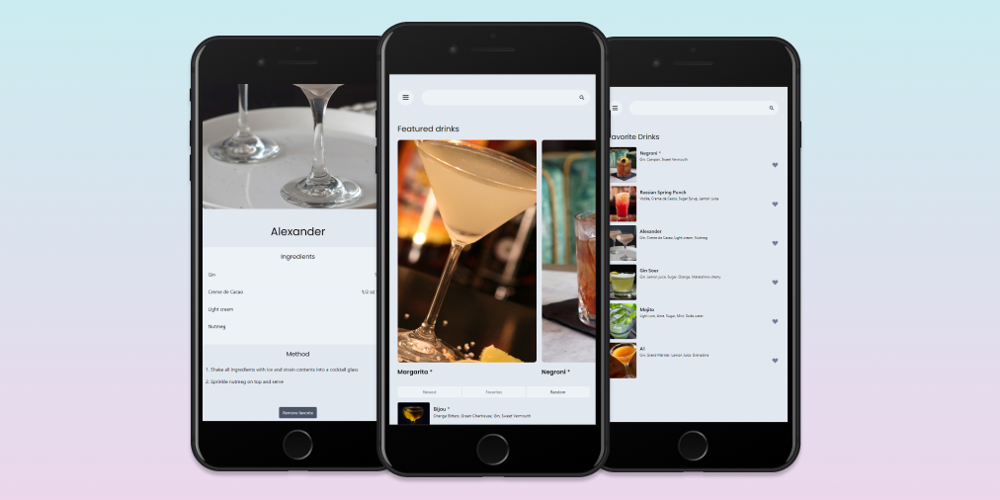

# minibar

Minibar is drinks inspiration, for when you've run out of ideas, or just want something cool to drink

## Screenshots



## Getting started

1. Clone the repo

```
git clone https://github.com/AlexKMarshall/minibar.git
cd minibar
```

2. Install dependencies

```
yarn install
```

3. Run mongodb service

```
sudo service mongodb start
```

4. Start the app

```
yarn start
```

## Tech Stack

### Front-end

- [React](https://reactjs.org/)
- [React-query](https://react-query.tanstack.com/)
- [Tailwind CSS](https://tailwindcss.com/)

### Back-end

- [Express](https://expressjs.com/)
- [MongoDb](https://www.mongodb.com/)
